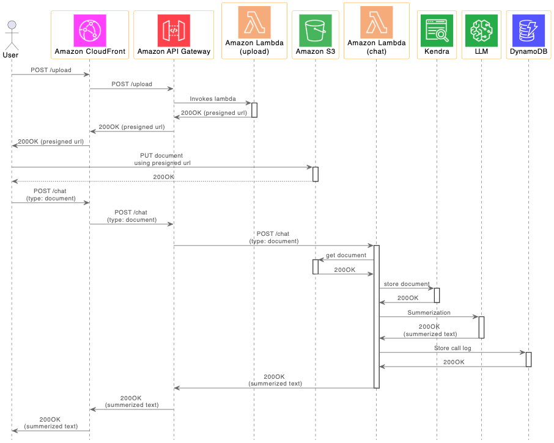

# Amazon Kendra를 이용한 Question/Answering Chatbot 만들기

여기서는 Amazon Bedrock의 LLM 모델을 이용하여 Question/Answering을 수행하는 Chatbot을 만듧니다. 또한 Amazon Kendra로 RAG를 구현하여, Question/Answering에 대한 환각(hallucination) 영향을 줄일 수 있습니다. 파일 업로드는 [Lambda (upload)](./lambda-upload/index.js)를 이용하여 presigned url을 얻어서, S3에 파일을 안전하게 저장합니다. 이후 S3에 Object로 저장된 문서 파일에 대한 bucket과 key 정보를 kendra에 전달하면 kendra에서 문서를 가져와서 인덱싱을 합니다. 이후 사용자가 질문을 하면, Kendra로 이용하여 가장 관련이 있는 문장을 조회하고 이를 이용하여 LLM이 좀 더 정확한 답변을 할 수 있습니다.

전체적인 Architecture는 아래와 같습니다. 사용자가 파일을 업로드하면 Amazon S3에 저장된 후, kendra에 전달되어 symantic search에 활용되어집니다. 이후 사용자가 텍스트로 질문을 하면, CloudFront - API Gateway를 지나 [Lambda (chat)](./lambda-chat/lambda_function.py)에 텍스트가 전달됩니다. 이제 kendra를 통해 검색을 수행하여, 미리 입력한 문서중에서 가까운 문장을 얻습니다. 이후 Bedrock의 LLM을 이용하여 답변을 얻습니다. 답변은 DynamoDB에 call log의 형태로 저장되어 추후 각종 통계정보나 결과를 분석하는데에 이용될 수 있습니다. LLM은 Bedrock을 LangChain 형식의 API를 통해 구현하였고, Chatbot을 제공하는 인프라는 AWS CDK를 통해 배포합니다. 


문서파일을 업로드하여 Kendra에 저장하는 과정은 아래와 같습니다.

1) 사용자가 파일 업로드를 요청합니다. 이때 사용하는 Upload API는 [lambda (upload)](.lambda-upload/index.js)는 S3 presigned url을 생성하여 전달합니다.
2) 이후 presigned url로 문서를 업로드 하면 S3에 Object로 저장됩니다.
3) Chat API에서 request type을 'document'로 지정하면 [lambda (chat)](./lambda-chat/index.js)은 S3에서 object를 로드하여 텍스트를 추출합니다.
4) 추출한 텍스트를 Kendra로 전달합니다.
5) 문서 내용을 사용자가 알수 있도록, 요약(summarization)을 수행하고, 결과를 사용자에게 전달합니다.

아래는 문서 업로드시의 sequence diagram입니다. 



채팅 창에서 텍스트 입력(Prompt)를 통해 Kendra로 RAG를 활용하는 과정은 아래와 같습니다.
1) 사용자가 채팅창에서 질문(Question)을 입력합니다.
2) 이것은 Chat API를 이용하여 [lambda (chat)](./lambda-chat/index.js)에 전달됩니다.
3) lambda(chat)은 Kendra에 질문과 관련된 문장이 있는지 확인합니다.
4) Kendra로 부터 얻은 관련된 문장들로 prompt template를 생성하여 대용량 언어 모델(LLM) Endpoint로 질문을 전달합니다. 이후 답변을 받으면 사용자에게 결과를 전달합니다.
5) 결과는 DyanmoDB에 저장되어 이후 데이터 분석등의 목적을 위해 활용됩니다.

아래는 kendra를 이용한 메시지 동작을 설명하는 sequence diagram입니다. 


## 주요 구성

### IAM Role

IAM Role에서 아래와 같이 kendra에 대한 Permission을 추가해야 합니다.

```java
{
    "Effect": "Allow",
    "Action": [
        "kendra:*"
    ],
    "Resource": "arn:aws:kendra:[your-region]:[your-account-id]:index/[index-id]"
}]
```

이를 [cdk-chatbot-with-kendra-stack.ts](./cdk-chatbot-with-kendra/lib/cdk-chatbot-with-kendra-stack.ts)에서는 아래와 구현할 수 있습니다.

```java
const region = process.env.CDK_DEFAULT_REGION;
const accountId = process.env.CDK_DEFAULT_ACCOUNT;
const kendraResourceArn = `arn:aws:kendra:${region}:${accountId}:index/${kendraIndex}`
if (debug) {
    new cdk.CfnOutput(this, `resource-arn-of-kendra-for-${projectName}`, {
        value: kendraResourceArn,
        description: 'The arn of resource',
    });
}
const kendraPolicy = new iam.PolicyStatement({
    resources: [kendraResourceArn],
    actions: ['kendra:*'],
});

roleLambda.attachInlinePolicy( // add kendra policy
    new iam.Policy(this, `kendra-policy-for-${projectName}`, {
        statements: [kendraPolicy],
    }),
);  
```

Kendra를 위한 trust policy는 아래와 같이 설정합니다.

```java
{
   "Version":"2012-10-17",
   "Statement":[
      {
         "Effect":"Allow",
         "Principal":{
            "Service":"kendra.amazonaws.com"
         },
         "Action":"sts:AssumeRole"
      }
   ]
}
```

따라서, [cdk-chatbot-with-kendra-stack.ts](./cdk-chatbot-with-kendra/lib/cdk-chatbot-with-kendra-stack.ts)와 같이 "kendra.amazonaws.com"을 추가합니다.

```java
const roleLambda = new iam.Role(this, `role-lambda-chat-for-${projectName}`, {
    roleName: `role-lambda-chat-for-${projectName}`,
    assumedBy: new iam.CompositePrincipal(
        new iam.ServicePrincipal("lambda.amazonaws.com"),
        new iam.ServicePrincipal("bedrock.amazonaws.com"),
        new iam.ServicePrincipal("kendra.amazonaws.com")
    )
});
```

[Troubleshooting Amazon Kendra Identity and Access](https://docs.aws.amazon.com/kendra/latest/dg/security_iam_troubleshoot.html)와 같이 Kendra는 "iam:PassRole"을 포함하여야 합니다. 

```java
{
    "Action": [
        "iam:PassRole"
    ],
    "Resource": [
        "arn:aws:iam::[account-id]:role/role-lambda-chat-for-chatbot-with-kendra",
    ],
    "Effect": "Allow"
}
```

이를 [cdk-chatbot-with-kendra-stack.ts](./cdk-chatbot-with-kendra/lib/cdk-chatbot-with-kendra-stack.ts)에서는 아래와 같이 구현할 수 있습니다.

```java
const passRoleResourceArn = roleLambda.roleArn;
const passRolePolicy = new iam.PolicyStatement({
    resources: [passRoleResourceArn],
    actions: ['iam:PassRole'],
});
roleLambda.attachInlinePolicy(
    new iam.Policy(this, `pass-role-of-kendra-for-${projectName}`, {
        statements: [passRolePolicy],
    }),
);
```  

### Bedrock을 LangChain으로 연결하기

Bedrock 접속을 위해 필요한 region name과 endpoint url을 지정하고, LangChain을 사용할 수 있도록 연결하여 줍니다. 여기서 Bedrock은 aws 개발 계정과 preview 계정이 상이하게 설정합니다.

```python
from langchain.llms.bedrock import Bedrock

bedrock_region = "us-west-2" 
bedrock_config = {
    "region_name":bedrock_region,
    "endpoint_url":"https://prod.us-west-2.frontend.bedrock.aws.dev"
}
    
if accessType=='aws':  # internal user of aws
    boto3_bedrock = bedrock.get_bedrock_client(
        region=bedrock_config["region_name"],
        url_override=bedrock_config["endpoint_url"])
else: # preview user
    boto3_bedrock = bedrock.get_bedrock_client(
        region=bedrock_config["region_name"])
    
modelInfo = boto3_bedrock.list_foundation_models()    
print('models: ', modelInfo)

modelId = 'amazon.titan-tg1-large'  # anthropic.claude-v1
llm = Bedrock(model_id=modelId, client=boto3_bedrock)    
```

접속에 대한 설정은 [cdk-chatbot-with-kendra-stack.ts](./cdk-chatbot-with-kendra/lib/cdk-chatbot-with-kendra-stack.ts)을 열어서 "accessType"을 아래와 같이 설정합니다. 


### Kendra

### 문서 등록

S3에 저장된 문서를 kendra로 전달하기 위하여, 아래와 같이 문서에 대한 S3 정보를 kendra의 [batch_put_document()](https://docs.aws.amazon.com/kendra/latest/APIReference/API_BatchPutDocument.html)을 이용하여 전달합니다. 

```python
documentInfo = {
    "S3Path": {
        "Bucket": s3_bucket,
        "Key": s3_prefix+'/'+s3_file_name
    },
    "Title": "Document from client",
    "Id": requestId
}

documents = [
    documentInfo
]

kendra = boto3.client("kendra")
kendra.batch_put_document(
    Documents = documents,
    IndexId = kendraIndex,
    RoleArn = roleArn
)
```

이때 전송할 수 있는 Document의 크기는 아래와 같습니다.
- 5 MB total size for inline documents
- 50 MB total size for files from an S3 bucket
- 5 MB extracted text for any file


업로드한 문서 파일에 대한 정보를 사용자에게 보여주기 위하여 아래와 같이 [load_summarize_chain](https://python.langchain.com/docs/use_cases/summarization)을 이용하여 요약(Summerization)을 수행합니다.

```python
file_type = object[object.rfind('.') + 1: len(object)]
print('file_type: ', file_type)

docs = load_document(file_type, object)
prompt_template = """Write a concise summary of the following:

{ text }
                
CONCISE SUMMARY """

PROMPT = PromptTemplate(template = prompt_template, input_variables = ["text"])
chain = load_summarize_chain(llm, chain_type = "stuff", prompt = PROMPT)
summary = chain.run(docs)
print('summary: ', summary)

msg = summary
```


### Question/Answering

Kendra는 구글 검색처럼 Query할 수 있는 텍스트의 길이 제한이 있습니다. [Quota: Characters in query text - tokyo](https://ap-northeast-1.console.aws.amazon.com/servicequotas/home/services/kendra/quotas/L-7107C1BC)와 같이 기본값은 1000자입니다. Quota는 조정 가능하지만 일반적 질문으로 수천자를 사용하는 경우는 거의 없으므로 아래와 같이 1000자 이하의 질문만 Kenra를 통해 관련 문서를 조회하도록 합니다. 

```python
querySize = len(text)

if querySize<1000: 
    msg = get_answer_using_template(text)
else:
    msg = llm(text)
```

아래와 같이 일정 길이 이하의 query는 [get_relevant_documents()](https://python.langchain.com/docs/modules/data_connection/retrievers/)을 이용하여 [Kendra Retriever](https://python.langchain.com/docs/integrations/retrievers/amazon_kendra_retriever)로 관련된 문장들을 가져옵니다. 이때 관련된 문장이 없다면 bedrock의 llm()을 이용하여 결과를 얻고, kendra에 관련된 데이터가 있다면 아래와 같이 template을 이용하여 [RetrievalQA](https://python.langchain.com/docs/modules/chains/popular/vector_db_qa)로 query에 대한 응답을 구하여 결과로 전달합니다.

```python
relevant_documents = retriever.get_relevant_documents(query)

if (len(relevant_documents) == 0):
    return llm(query)
else:
    prompt_template = """Human: Use the following pieces of context to provide a concise answer to the question at the end. If you don't know the answer, just say that you don't know, don't try to make up an answer.

    { context }

    Question: { question }
    Assistant: """
    PROMPT = PromptTemplate(
        template = prompt_template, input_variables = ["context", "question"]
    )

    qa = RetrievalQA.from_chain_type(
        llm = llm,
        chain_type = "stuff",
        retriever = retriever,
        return_source_documents = True,
        chain_type_kwargs = { "prompt": PROMPT }
    )
    result = qa({ "query": query })     
```

여기서 RetrievalQA을 이용한 Query시 얻어진 metadata의 형태는 아래와 같습니다.


metadata에서 title과 document_attributes으로 부터 reference 정보를 추출한 후에 결과와 함께 전달합니다. 

```python
def get_reference(docs):
    reference = "\n\nFrom\n"
    for doc in docs:
        name = doc.metadata['title']
        page = doc.metadata['document_attributes']['_excerpt_page_number']
    
        reference = reference + (str(page)+'page in '+name+'\n')
    return reference

source_documents = result['source_documents'] 
if len(source_documents)>=1:
    reference = get_reference(source_documents)
    return result['result']+reference
else:
    return result['result']
```

## 실습하기

### CDK를 이용한 인프라 설치
[인프라 설치](./deployment.md)에 따라 CDK로 인프라 설치를 진행합니다. [CDK 구현 코드](./cdk-chatbot-with-kendra/README.md)에서는 Typescript로 인프라를 정의하는 방법에 대해 상세히 설명하고 있습니다.


## 실행결과

파일을 올리면 먼저 파일을 S3에 올리고, 이후로 kendra에 등록합니다. 업로드 한 파일의 내용을 확인하기 위하여 아래와 같이 요약(Summeraztion)을 수행합니다.


이후 아래와 같이 문서 내용에 대해 질문을 하면 답변을 얻을 수 있습니다.


#### Chatbot 동작 시험시 주의할점

일반적인 chatbot들은 지속적인 세션을 유지 관리하기 위해서는 websocket 등을 사용하지만, 여기서 사용한 Chatbot은 API를 테스트하기 위하여 RESTful API를 사용하고 있습니다. 따라서, LLM에서 응답이 일정시간(30초)이상 지연되는 경우에 브라우저에서 답변을 볼 수 없습니다. 따라서 긴 응답시간이 필요한 경우에 CloudWatch에서 [lambda-chat](./lambda-chat/lambda_function.py)의 로그를 확인하거나, DynamoDB에 저장된 call log를 확인합니다.


## Reference 

[Kendra - LangChain](https://python.langchain.com/docs/integrations/retrievers/amazon_kendra_retriever)

[kendra_chat_anthropic.py](https://github.com/aws-samples/amazon-kendra-langchain-extensions/blob/main/kendra_retriever_samples/kendra_chat_anthropic.py)

[IAM access roles for Amazon Kendra](https://docs.aws.amazon.com/kendra/latest/dg/iam-roles.html)

[Adding documents with the BatchPutDocument API](https://docs.aws.amazon.com/kendra/latest/dg/in-adding-binary-doc.html)

[class CfnIndex (construct)](https://docs.aws.amazon.com/cdk/api/v2/docs/aws-cdk-lib.aws_kendra.CfnIndex.html)

[boto3 - batch_put_document](https://boto3.amazonaws.com/v1/documentation/api/1.26.99/reference/services/kendra/client/batch_put_document.html)

